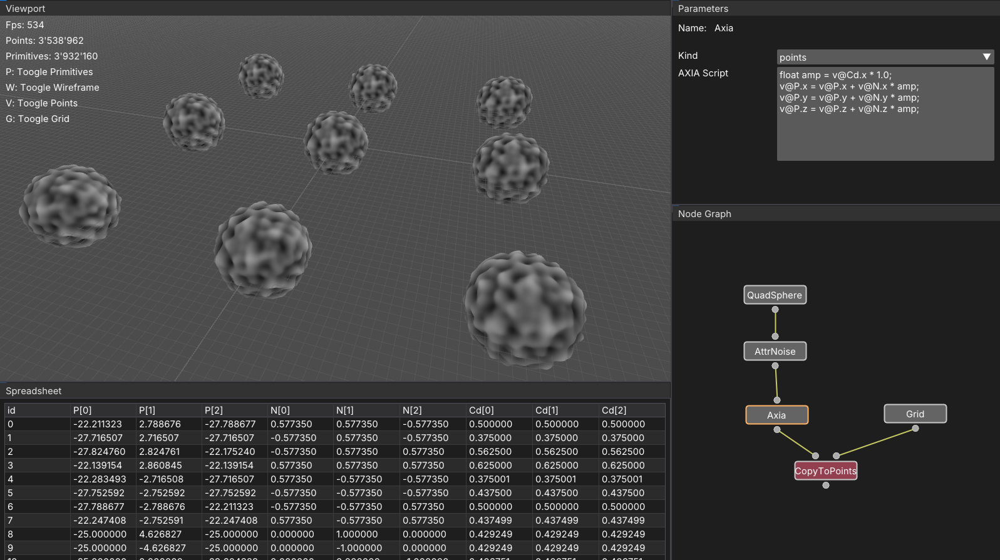

# Euclide

Euclide is a high-performance, node-based procedural system inspired by **SideFX Houdini**, focused on geometry processing, data-oriented design, and scalability.

It is designed as an experimental platform to explore modern CPU/GPU execution models, memory layouts, and domain-specific languages for procedural workflows.

## Overview

Euclide provides a **graph-based** computation model where nodes operate on geometry and structured data.
The system is built from the ground up with performance and extensibility in mind, targeting both **CPU vectorization** and **GPU parallelism**.

The project is primarily aimed at:
- Engine / graphics programmers
- Technical artists
- Developers interested in procedural generation and performance-oriented design

## Features

- Node-based procedural graph
- High-performance geometry processing
- Data-oriented core architecture
- CPU and GPU execution paths
- Custom expression language (AXIA)

## Architecture and Technology

Key technical aspects of Euclide include:
- **SoA (Structure of Arrays)** memory layout for mesh data to improve cache locality and SIMD efficiency.
- **Manual SIMD optimizations** in performance-critical sections where compiler auto-vectorization is insufficient.
- **Vulkan compute shaders** for massively parallel node execution (e.g. noise generation).
- **AXIA**, a custom interpreted language inspired by VEX, designed for procedural expressions and per-element logic.
    - Future plans include JIT compilation to reduce interpretation overhead.
- **Clear separation between UI and core systems**, enabling headless execution and easier testing.
- **Test coverage** of the core computation layer.

## Current Status

Euclide is under active development and undergoing a major internal rework.
This project should currently be considered experimental.

## Roadmap (non-exhaustive)

- Rework the main target of Euclide
- Expand AXIA language features and integrate JIT compilation
- Add more GPU-accelerated nodes
- Improve graph scheduling and execution strategies
- Extend geometry and attribute types
- Improve documentation and examples